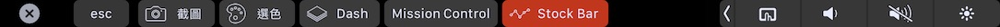
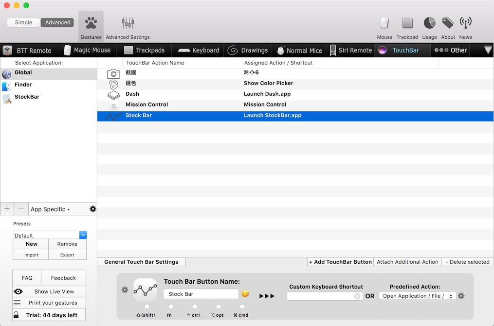
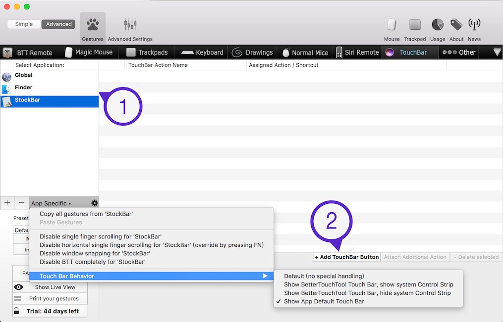

# StockBar

---

This tiny apps grabs information of stocks from the Notification Center widget and represents it on the Touch Bar.

## Using StockBar with BTT

Since you can't add customized buttons in "Control Srtip", you can use [BetterTouchTool](https://www.boastr.net) to add buttons as a workaround.

Firstly, add a custom button to open StockBar.app

Then, check "Show App Default Touch Bar", so that the items of BTT would be disappeared when StockBar is activated.

## Download

[https://github.com/hirakujira/StockBar/releases](https://github.com/hirakujira/StockBar/releases)

## License

MIT.

Because I'm lazy.